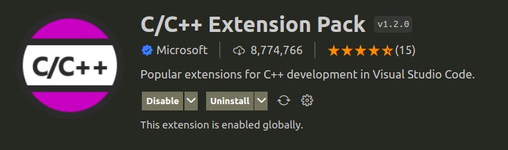
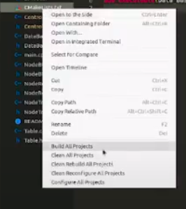

## 4. Instalación
Para el uso de este software debe tener en consideración los siguientes aspectos:
### 4.1. Requisitos de Software
* Compilador de C++ que soporte el standar C++17.
* Compilador recomendado: MinGW para Windows y G++ para Linux.
* Tener instalado Cmake (versión minima 3.16)
* Espacio en disco para la creación de las base de datos
* Se recomienda un Editor de código como Visual Studio Code o IDEs como Clion o Visual Studio.

### 4.2. Plataformas
El software puede ser ejecutado tanto en las plataformas Linux como Windows.

### 4.3. Dependencias
Para que el software funcione correctamente no es necesaria la instalación de ninguna dependencia adicional.
Solo se usaron las Librerías Estandar de C++.

### 4.4. Instrucciones de instalación
El proyecto puede ser ejecutado tanto en linux como windows. Se puede clonar el repositorio o descargar como ZIP y
descomprimirlo en la carpeta donde desea crear la base de datos.
Para comenzar la ejecución, úbiquese dentro de la carpeta clonada o descomprimida.

**Compilación y ejecución en LINUX**

Primero, asegúrese de cumplir con el punto *4.1. Requisitos de Software*.
* Si su distribución de GNU/Linux esta basado en Ubuntu y no tiene instalado un compilador de c++ puede seguir estos pasos:
  [Install and Use G++ on Ubuntu](https://linuxhint.com/install-and-use-g-on-ubuntu/).
* Si su distribución de GNU/Linux esta basado en Ubuntu y no tiene instalado CMake puede seguir estos pasos:
  [How to Install CMake on Ubuntu](https://vitux.com/how-to-install-cmake-on-ubuntu/).
* Para otras distribuciones, consulte la documentación oficial.

* Pruebe con `sudo apt install cmake` para la instalación de cmake

Use la línea de comandos para ubicarse dentro de la carpeta **src** y  ejecute las siguientes intrucciones:

1. `mkdir build`
2. `cd build/`
3. `cmake ..`
4. `make`
5. `./Data_Base_Management_System`

**Compilación y ejecución en WINDOWS**

Primero, asegúrese de cumplir con el punto *4.1. Requisitos de Software*.
* Si no tiene instalado un compilador de c++ puede instalarlo siguiendo estos pasos:
  [Instalar MinGW Windows](https://www.solvetic.com/tutoriales/article/9125-instalar-mingw-windows-10/).
* Si no tiene instalado CMake puede instalarlo siguiendo estos pasos:
  [Installing CMake](https://cmake.org/install/).

Se recomienda el uso de Visual Studio Code agregando la extensión C/C++ Extension Pack:

A continuación siga los siguientes pasos:
1. Abra la carpeta con Visual Studio Code
2. Dentro de DBMAN, haga clic derecho en *CMakeLists.txt* y escoja la opción *Build All Projects*

3. Terminado de construir use la terminal para ejecutar los siguientes comandos:

* `cd "build"`
* `.\Data_Base_Management_System`

Si trabaja con otro editor de código o IDE consulte su documentación oficial.
